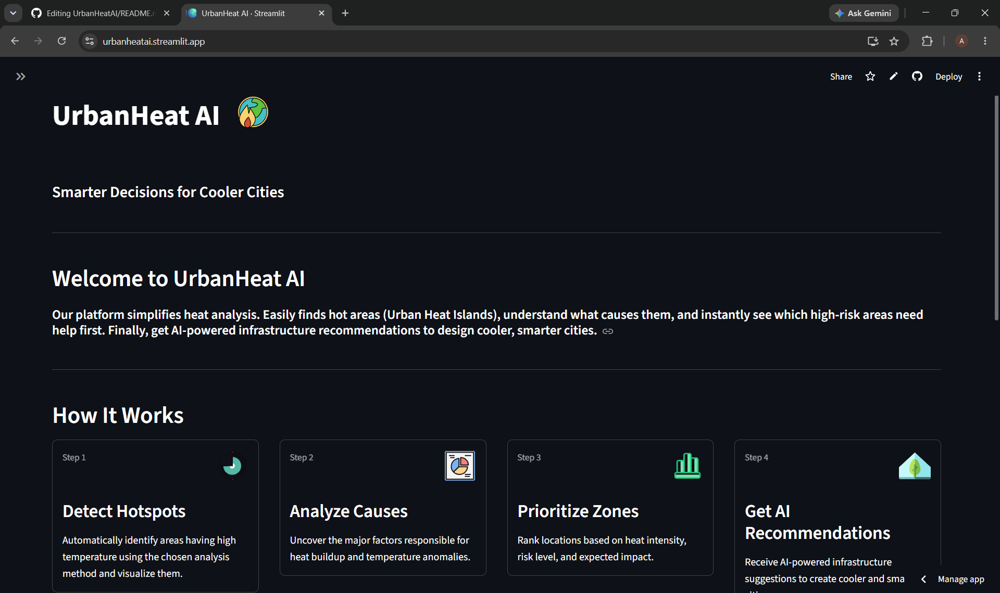

# UrbanHeat AI 🌍 

> **AI-Powered Urban Heat Island Detection & Smart Urban Planning Platform**

UrbanHeat AI is an intelligent geospatial analysis platform that helps identify **Urban Heat Island (UHI)** hotspots using **Landsat 9 satellite imagery**, **remote sensing indices**, and **AI-powered spatial analysis**. The platform explains the causes of urban heat buildup, prioritizes high-risk zones, compares multiple cities, and generates infrastructure recommendations using **Google Gemini AI**.

Built with **Python**, **Streamlit**, **Rasterio**, **Scikit-learn**, and **Google Gemini**, the application transforms raw satellite imagery into actionable insights for urban planners, researchers, and environmental professionals.

**🚀 Live Demo:** https://urbanheatai.streamlit.app/




---

## 🚀 Features

### 🔥 AI-Based Urban Heat Detection
- Detects Urban Heat Island hotspots using K-Means clustering.
- Identifies high-risk heat zones from satellite-derived temperature data.
- Generates interactive heatmaps for visualization.

### 🌿 Remote Sensing Analysis
Computes important environmental indices including:

- **NDVI** (Normalized Difference Vegetation Index)
- **NDBI** (Normalized Difference Built-up Index)
- **NDWI** (Normalized Difference Water Index)

These indices help explain why certain regions experience higher temperatures.

### 📊 Intelligent Dashboard
Provides detailed insights such as:

- Mean surface temperature
- Hotspot area (km²)
- High-risk area percentage
- Temperature statistics
- Vegetation statistics
- Urban heat distribution

### 🏙 Multi-City Comparison
Compare multiple cities side by side using:

- Heatmaps
- Temperature statistics
- NDVI comparison
- Hotspot percentage
- Risk analysis

### 🤖 AI Infrastructure Recommendations
Powered by **Google Gemini**, the platform provides:

- Causes of urban heat
- Urban planning insights
- Infrastructure recommendations
- Mitigation strategies
- Sustainability suggestions

### 📈 Interactive Visualizations
- Heatmaps
- Statistical charts
- Risk indicators
- Comparative analytics
- Planning insights

---

## 🛠 Tech Stack

| Category | Technologies |
|----------|--------------|
| Language | Python |
| Frontend | Streamlit |
| Remote Sensing | Rasterio |
| Numerical Computing | NumPy |
| Data Analysis | Pandas |
| Machine Learning | Scikit-learn (K-Means) |
| Visualization | Plotly, Matplotlib |
| AI | Google Gemini API |
| Version Control | Git & GitHub |

---

## 📂 Project Structure

```text
UrbanHeatAI/
│
├── assets/
├── components/
├── data/
│   └── raw/
├── utils/
├── app.py
├── requirements.txt
├── README.md
└── config.py
```

---

## ⚙️ How It Works

### Step 1
Load Landsat 9 satellite bands.

### Step 2
Preprocess imagery and calculate environmental indices.

### Step 3
Estimate Land Surface Temperature (LST).

### Step 4
Detect Urban Heat Islands using AI-based clustering.

### Step 5
Generate hotspot maps and statistics.

### Step 6
Analyze causes using NDVI, NDBI, and NDWI.

### Step 7
Generate AI-powered urban planning recommendations.

---

## 📷 Dataset

Satellite imagery used:

- **Landsat 9 Collection 2**
- Source: **USGS Earth Explorer**

Required bands:

- B3 (Green)
- B4 (Red)
- B5 (Near Infrared)
- B6 (SWIR)
- B10 (Thermal Infrared)

---

## 💡 Applications

UrbanHeat AI can support:

- Smart city planning
- Climate resilience studies
- Environmental monitoring
- Green infrastructure planning
- Urban sustainability assessment
- Academic and research projects

---

## ▶️ Installation

Clone the repository

```bash
git clone https://github.com/AanyaAgrahari28/UrbanHeatAI.git
```

Move into the project directory

```bash
cd UrbanHeatAI
```

Install dependencies

```bash
pip install -r requirements.txt
```

Run the application

```bash
streamlit run app.py
```

---

## 📌 Key Highlights

- AI-powered Urban Heat Island detection
- Landsat 9 satellite image processing
- Remote sensing index analysis
- Interactive Streamlit dashboard
- Multi-city comparison
- Google Gemini integration
- Urban planning recommendations
- End-to-end geospatial analysis pipeline

---

## 📸 Screenshots

Add screenshots of:

- Home Page
- Dashboard
- AI Heatmap
- Compare Cities
- AI Recommendations

---

## 🔮 Future Improvements

- Support for additional cities
- Time-series heat analysis
- Automatic Landsat image download
- Export reports as PDF
- Interactive GIS layers
- Building-level heat analysis
- Climate trend forecasting
- Integration with additional satellite datasets

---

## 👨‍💻 Author

**Aanya Agrahari**

B.Tech Information Technology

---

## 📜 License

This project is intended for educational, research, and demonstration purposes.
